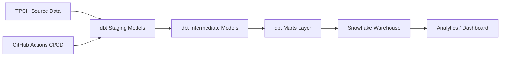

Welcome to the dbt snowflakes  project!

# TPCH Analytics Pipeline (dbt + Snowflake + CI/CD)

## Overview

This project demonstrates an end-to-end data pipeline using dbt and Snowflake, with automated CI/CD via GitHub Actions.

## Tech Stack

* dbt
* Snowflake
* GitHub Actions

## Architecture

* Source: TPCH dataset
* Transformation: dbt (staging → intermediate → marts)
* Warehouse: Snowflake
* CI/CD: GitHub Actions

## Key Models

* dim_customers
* fct_orders
* fct_order_items

## Features

* Modular data modeling
* Automated pipeline execution
* Scalable architecture

## How to Run

1. Configure Snowflake credentials
2. Run `dbt build`

## Architecture Diagram

