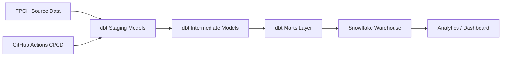

Welcome to your new dbt project!

# TPCH Analytics Pipeline (dbt + Snowflake + CI/CD)

## Overview

This project demonstrates an end-to-end data pipeline using dbt and Snowflake, with automated CI/CD via GitHub Actions.

## Tech Stack

* dbt
* Snowflake
* GitHub Actions

## Architecture

* Source: TPCH dataset
* Transformation: dbt (staging → intermediate → marts)
* Warehouse: Snowflake
* CI/CD: GitHub Actions

## Key Models

* dim_customers
* fct_orders
* fct_order_items

## Features

* Modular data modeling
* Automated pipeline execution
* Scalable architecture

## How to Run

1. Configure Snowflake credentials
2. Run `dbt build`

### Using the starter project

Try running the following commands:
- dbt run
- dbt test

### Resources:
- Learn more about dbt [in the docs](https://docs.getdbt.com/docs/introduction)
- Check out [Discourse](https://discourse.getdbt.com/) for commonly asked questions and answers
- Join the [chat](https://community.getdbt.com/) on Slack for live discussions and support
- Find [dbt events](https://events.getdbt.com) near you
- Check out [the blog](https://blog.getdbt.com/) for the latest news on dbt's development and best practices

## Architecture Diagram

